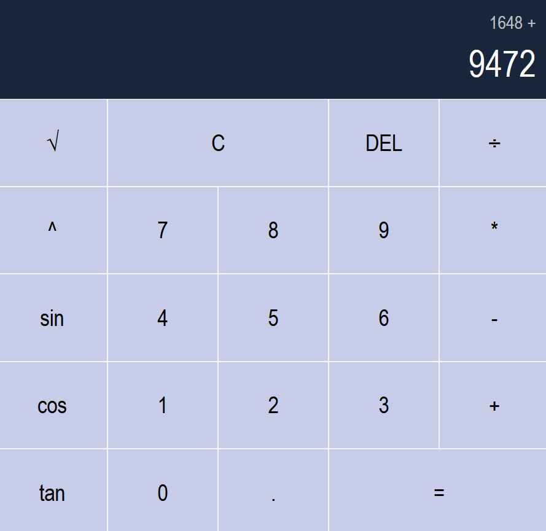
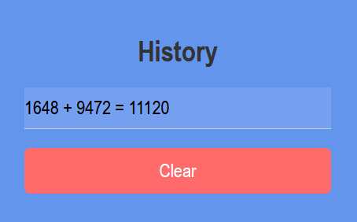

# React Calculator
A calculator made in React with an AWS Lambda backend.

## Quick Start with Docker

### Pull and Run the Pre-Built Docker Image

You can quickly get started by pulling and running the pre-built image from Docker Hub. This version is already configured with the necessary API URL for calling AWS Lambda.

1. Pull the Docker image:
   ```bash
   docker pull vladcranga/react-calculator
   ```

2. Run the Docker container:
   ```bash
   docker run -p 3000:3000 vladcranga/react-calculator
   ```

3. Open [http://localhost:3000](http://localhost:3000) in your browser to use the calculator.

> **Note**: This image is ready to use with the API endpoint pre-configured, so no additional setup is needed.

## Manual Setup

If you prefer to clone and set up the project yourself or use a custom API URL, follow these steps:

1. Clone the repository:
   ```bash
   git clone https://github.com/vladcranga/react-calculator.git
   ```

2. Navigate to the project directory:
   ```bash
   cd react-calculator
   ```

3. Install dependencies:
   ```bash
   npm install
   ```

4. Set up environment variables:

   - Obtain your API invoke URL (e.g., from AWS API Gateway).
   - Create a `.env` file in the project root with the following content:
     ```plaintext
     REACT_APP_API_URL=your_api_invoke_url
     ```

   > **Note**: This project includes an AWS Lambda backend function in `calculatorBackend/index.mjs`. To use it, deploy the function to AWS Lambda, then create an API Gateway to connect to it.

5. Start the development server:
   ```bash
   npm start
   ```

   Open [http://localhost:3000](http://localhost:3000) to view the application in your browser.

## Features

- Add, subtract, multiply, and divide integers and floating-point numbers
- Advanced functions for complex calculations
- Clear and delete buttons: clear the entire number or just one digit
- Operation chaining for multiple calculations
- Calculation history to track previous results
- Keyboard support for a faster user experience





## Credits

- Calculator icon by Arthur Zaynullin from [icon-icons](https://icon-icons.com/icon/calculator/72046).

## License

This project is licensed under the [MIT License](https://opensource.org/license/MIT).
